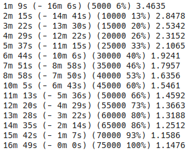
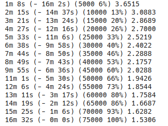
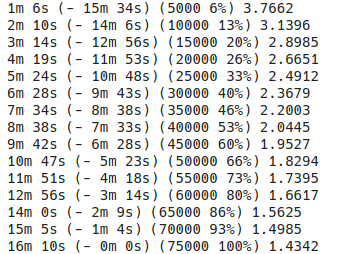

# E2A10

## Objectives
The objective of this assignment is to replace the (random) embedding of the code presented in the class with GloVe embeddings. 

## GloVe Embeddings - English
GloVe stands for 'Global Vectors for Word Representation'. It is an unsupervised learning algorithm used to obtain an efficient vector represntations of words in order to better capture their meanings and their relations. A frequently given example is that the 'distance' between the word `man` and `woman` must be close to the distance between `king` and `queen`.


These embeddings are available at [nlp.stanford.edu](https://nlp.stanford.edu/projects/glove/). There are a number of models available that differ in the source of text, the embedding dimensions, and the number of words in the vocabulary.

## Skip-Gram Embeddings - French
This is a pre-trained word2vec embeddings for the French language. It is available at [fauconnier.github.io](https://fauconnier.github.io/index.html#wordembeddingmodels). Various models (cbow/skip-gram) of different dimensions are available.


## Code Segments

### Building the list of vectors (English)

This code builds a list of GloVe vectors. It also mainains a dictionary for mapping from word to index and a list (which helps to map from index to word).

```python
glove_words = []
idx = 0
glove_word2id = {}
glove_vectors = []

with open(f'{glove_path}/glove.twitter.27B.200d.txt', 'rb') as f:
    for l in f:
        line = l.decode().split()
        word = line[0]
        glove_words.append(word)
        glove_word2id[word] = idx
        idx += 1
        word_vector = np.array(line[1:]).astype(np.float)
        glove_vectors.append(word_vector)
```
### Unknown Words (English)

To ensure that there are no words in the training data that lack a GloVe representation, the `InputLang` class was populated with the words in our GloVe vectors' list. If the number of words increased from the ones present in GloVe, that indicated the presence of missing words.

```python
self.word2index = { k : v for k , v in sorted(glove_word2id.items(), key=operator.itemgetter(1))}
self.word2count = { word : 1 for word in glove_words }
self.index2word = { i : word for word, i in glove_word2id.items() }
self.n_words = len(glove_words) # 1193514
```


Result: 
- Using Common Crawl (1.9M+ vocab, uncased, 300d), `n_words` changed from **1917494** to **1917495**. The missing word? It is *ooita* 😂
- Using Twitter (1.2M+ vocab, uncased, 200d), `n_words` changed from **1193514** to **1193522**. The missing words are (henpecked, farsighted, unambitious, dramatist, oceanographer, accustoming, particularily, chiseling). Interestingly, the word 'ooita' is present!!!

**Why was the Twitter-based GloVe used? In our Seq2Seq Model, the hidden units of the encoder are passed to the decoder. Therefore, they must have the same dimensions. The former has 300d representation only, whereas the latter has a 200d representation. The maximum representation of the French dataset that I used was 200**

(Theses lines were removed in subseqeunt training steps, defaulting to the `eos` and `sos` tokens - which are (obviously) missing in the GloVe representations since they are not words per se)

### Matrix of Embeddings  (English + French)

After building the dictionary, a matrix of embeddings was populated. This matrix contains only the embeddings of the words in the vocabulary and not the entire ~2M words!

```python
matrix_len = input_lang.n_words
weights_matrix = np.zeros((matrix_len, 200))
words_found = 0
for i, word in enumerate(input_lang.word2index):
    try: 
        weights_matrix[i] = glove_word2vec[word]
        words_found += 1
    except KeyError:
        weights_matrix[i] = np.random.normal(scale=0.6, size=(200, ))

```

### The Embedding Layer (English + French)

These embeddings are used as the first layer in our EncoderRNN. Also, since these are 'trained', we need to make sure that backpropagation doesn't affect these embeddings. So we make them non-trainable by setting the `requires_grad` argument of their parameters to `False`

```python
self.embedding = nn.Embedding(input_size, hidden_size)
self.embedding.weight.data.copy_(torch.from_numpy(weights_matrix))
for param in self.embedding.parameters():
        param.requires_grad = False
```

## Results for English-French Translations
To ensure a fair comparison, all models have a 200 hidden size (for both the encoder and the decoder)

#### No Embeddings


#### English Embeddings



#### English + French Embeddings 


## Conclusion
Using embeddings should - in theory - improve the performance as well as reduce the training time since we no longer manipulate the embeddings. Although time was reduced using embeddings, the performance infact worsened. More models/data is needed to investigate this result.
